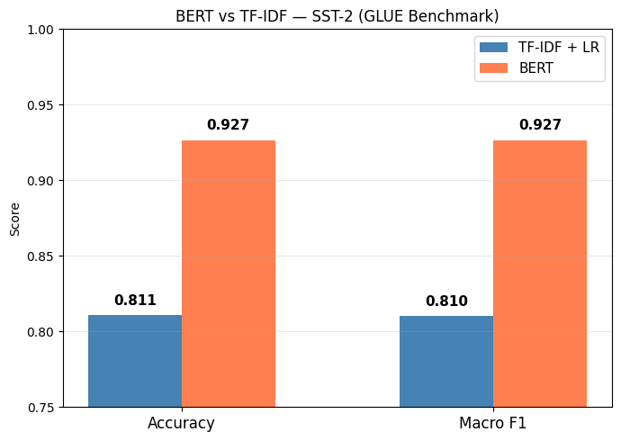
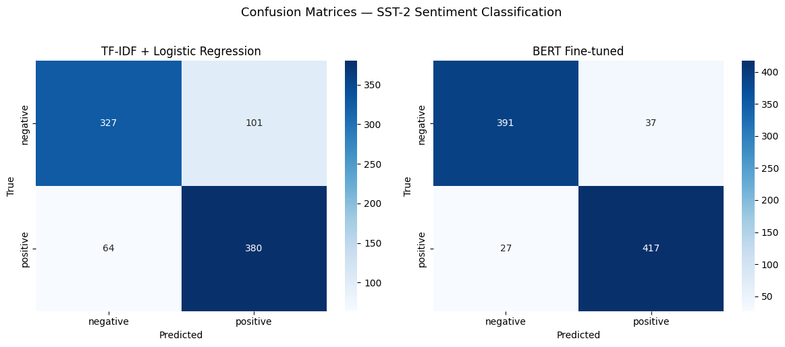
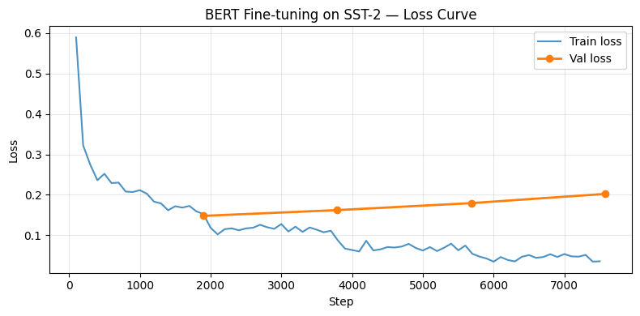

# BERT vs TF-IDF: Sentiment Classification on SST-2

This project compares two different approaches for sentiment classification: a simple and classic method (TF-IDF with Logistic Regression) and a modern deep learning method (fine-tuned BERT). The goal is to see how much better BERT performs, and to understand why.

Sentiment classification means deciding if a sentence has a positive or negative meaning. For example, "This movie was fantastic" is positive, and "I hated every minute of it" is negative.

The dataset used is **SST-2** (Stanford Sentiment Treebank), which is part of the well-known GLUE benchmark. It contains short sentences from movie reviews.

---

## Results

| Model | Accuracy | Macro F1 |
|---|---|---|
| TF-IDF + Logistic Regression | 0.8108 | 0.8101 |
| BERT fine-tuned | 0.9266 | 0.9265 |
| Difference | +0.1158 | +0.1165 |

BERT is about **11.6 points better** than the TF-IDF baseline in both accuracy and Macro F1.



---

## Dataset

**SST-2** from the [GLUE benchmark](https://huggingface.co/datasets/stanfordnlp/sst2).

- Each sentence is labeled as either **positive** or **negative**
- Training set: **67,349 sentences**
- Test set: **872 sentences** (428 negative, 444 positive)

Note: the official GLUE test labels are not public, so the GLUE validation split is used here as the test set. This is a common and accepted practice.

---

## The two models

### Model 1: TF-IDF + Logistic Regression (baseline)

TF-IDF is a classic way to turn text into numbers. It looks at how often a word appears in a sentence and how rare that word is across all sentences. Words that appear often in one sentence but rarely in others get a higher score.

In this project:
- Used unigrams, bigrams, and trigrams (single words, pairs of words, and groups of three words)
- Kept the top 50,000 most useful features
- Used sublinear TF scaling to reduce the effect of very common words
- Trained a Logistic Regression classifier on top of these features

This is a fast and simple method, but it does not understand word order or the full meaning of a sentence.

### Model 2: BERT fine-tuned

BERT (Bidirectional Encoder Representations from Transformers) is a deep learning model. It reads the whole sentence at once and understands how each word relates to the other words around it. This makes it much better at understanding meaning, context, and things like negation.

In this project:
- Used `bert-base-uncased` (lowercase text, 110 million parameters)
- Added a classification head on top of BERT for the sentiment task
- Fine-tuned for **4 epochs** on the SST-2 training set
- Maximum token length set to **64** (enough for SST-2 sentences, which are short)
- Trained on a T4 GPU using Google Colab (training time: about 17 minutes)

---

## Visualizations

### Confusion Matrices

A confusion matrix shows how many sentences were classified correctly and how many were wrong, for each class.



- **TF-IDF model:** got 327 out of 428 negative sentences correct (missed 101), and 380 out of 444 positive sentences correct (missed 64)
- **BERT model:** got 391 out of 428 negative sentences correct (missed only 37), and 417 out of 444 positive sentences correct (missed only 27)

BERT makes fewer mistakes in both directions. It is more balanced and more accurate for both classes.

### Training Loss Curve



- The **blue line** is the training loss. It goes down quickly at first, and keeps getting smaller across all 4 epochs.
- The **orange line** is the validation loss. It goes down a little at first, then slowly starts to go back up.

This pattern is called **overfitting**. It means the model starts to memorize the training data too much in later steps. However, the final test accuracy is still very high (92.66%), so the model still performs well on new sentences.

---

## Why does BERT do better?

There are three main reasons:

1. **Context understanding.** TF-IDF treats each word or phrase as a separate signal, without understanding the full sentence. BERT reads the whole sentence at once and understands how words relate to each other.

2. **Handling negation.** A sentence like "not as bad as expected" contains the word "bad", which might confuse a TF-IDF model into predicting negative. BERT understands that "not as bad" is actually closer to positive.

3. **Pretraining.** Before fine-tuning, BERT was already trained on a huge amount of text. It already knows a lot about how language works, so it only needs a small amount of task-specific training to perform very well.

---

## Files

```
bert-vs-tfidf-sst2/
├── bert_sst2_cv.ipynb      -- full notebook with all code, training, and plots
├── report.md               -- detailed written report with analysis and discussion
├── report.pdf              -- same report in PDF format (compiled from LaTeX)
├── requirements.txt        -- Python packages needed to run the notebook
└── outputs/
    ├── model_comparison.png   -- bar chart comparing accuracy and F1 for both models
    ├── confusion_matrix.png   -- confusion matrices for both models side by side
    ├── loss_curve.png         -- BERT training and validation loss across all steps
    └── results.json           -- all metrics stored in JSON format
```

---

## How to run

It is recommended to run this on **Google Colab** with a T4 GPU. Training BERT on CPU would take much longer.

**Step 1: Clone the repo**
```bash
git clone https://github.com/AdhamALI68/bert-vs-tfidf-sst2.git
cd bert-vs-tfidf-sst2
```

**Step 2: Install dependencies**
```bash
pip install -r requirements.txt
```

**Step 3: Open the notebook**
```bash
jupyter notebook bert_sst2_cv.ipynb
```

Or just open `bert_sst2_cv.ipynb` directly in Google Colab and run all cells from top to bottom.

---

## Requirements

Main packages used:

- `transformers` (HuggingFace, for BERT)
- `datasets` (HuggingFace, for loading SST-2)
- `torch` (PyTorch, for training)
- `scikit-learn` (for TF-IDF and Logistic Regression)
- `seaborn` and `matplotlib` (for plots)

See `requirements.txt` for the full list.

---

## Author

**Adham Ali**
Computer Engineering student at The American University in Cairo (AUC)
Concentration: Artificial Intelligence

GitHub: [AdhamALI68](https://github.com/AdhamALI68)
LinkedIn: [adham-ali](https://linkedin.com/in/adham-ali)

